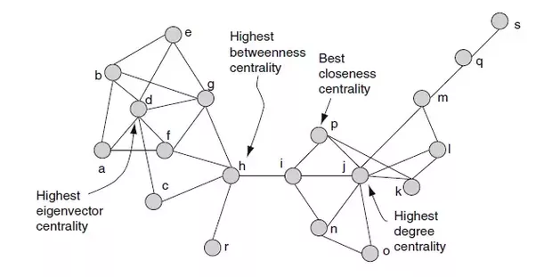

```{r include = FALSE}
library(htmltools)
library(SWOW)
library(knitr)
library(gridExtra)
```


# Load network
For this example, we will use the USF network [@Nelson2004] again as some centrality measures take a long time to compute on very large graphs (> 10,000 nodes).


Before we proceed, we need to make sure the graph is simple (i.e. it does not contain any loops). 


```{r echo=FALSE}
G.usf  = importGraph(USF)

# In this case we want a simple graph with no loops and multiple edges.
message('Is the graph simple? ', igraph::is_simple(G.usf))

# Let's take a look why
print(igraph::E(G.usf)[[igraph::which_loop(G.usf)]])

# Remove any loops
G.usf = igraph::simplify(G.usf)

```

In some cases, participants did respond with the same word as the cue word, so these are removed.


# Graph connectedness
## Isolated nodes
Isolated nodes that do not have either incoming or outgoing links or both. We sometimes refer to them as *hapax legomena*, or words that only occur once in a corpus or text. The chance of observing such nodes depends on the size of the network.

```{r}
Hapax.usf = getHapaxNodes(G.usf,mode = 'strong')
```
<br>
The list contains `r length(Hapax.usf)` nodes with *neither* incoming or outgoing edges is:
```
`r paste(Hapax.usf,collapse=', ')`
```

Since the graph only consist of words that are also cue words, this list basically contains those words that were never produced by a single participant.

## Graph components
A related idea is that of graph components. A component of a graph associated with a node $v_i$ is the maximal connected induced subgraph containing all nodes that are connected to $v_i$. In directed graphs, the *weakly connected component* does not consider whether an edge is in- or out-going, whereas the *strongly connected component* requires that all nodes in the component are connected through in- and out-going edges. Finally, the *largest connected component* is the induced subgraph which contains the maximum number of nodes.

The word association network is a directed graph and many directed centrality measures can only be calculated if all nodes are part of a strongly connected component. The original order of the graph (i.e. the number of nodes) is `r igraph::vcount(G.usf)`.

Let's extract the largest strongly connected component.

```{r echo=FALSE}
comp.usf = igraph::components(G.usf,mode = 'strong')
comp.usf = data.frame(component_size = comp.usf$csize) %>% group_by(component_size) %>% tally()
print(comp.usf)

# Reduce to the largest connected component
G.usf = getLargestComponent(G.usf,mode = 'strong')

# Since this removes nodes, it affects the normalized associative strength edge weights.
# Let's recompute:
G.usf = normalizeEdgeWeights(G.usf)

vlabels = igraph::V(G.usf)$name

```

In this case, there's one large component, and 52 components that correspond to the isolated vertices identified above. The number of nodes after extracting the largest connected components is `r igraph::vcount(G.usf)`. 

# Local centrality measures
Local centrality measures considers how a node is connected with its direct neighbors. This includes measures such as the number of incoming edges (`in-degree` $k_{in}$), the number of outgoing edges (`out-degree` $k_{out}) and weighted versions of these measures (*strength*).

```{r centralityTable, warning=FALSE}
ct_k = tibble(names  = vlabels,
                    degree_in = igraph::degree(G.usf, mode = 'in'),
                    degree_out = igraph::degree(G.usf, mode = 'out'),
                    strength_in = igraph::strength(G.usf,mode = 'in'),
                    strength_out = igraph::strength(G.usf, mode = 'out'))

DT::datatable(ct_k)  
```

Not surprisingly, the out-strength is the same for each node. This is because the summed associative strengths for each node are normalized to sum to one.

# Global centrality measures
In contrast to local centrality measures which only count the number and the strength of a node and its direct neighbors, *global* centrality measures consider the centrality of the neighbors as well to determine how central a node $v_i$ is. There are hundreds of ways of calculating centrality, resulting in highly related measures that capture slightly different aspects about what nodes are important.

<center>

</center>


## Neighborhood size
One idea is to consider the neighbors of neighbors in calculating degree and strength.

```{r NBCentralityTable, warning=FALSE}
ct_nb = tibble(names = vlabels,
                    nb3_out = igraph::neighborhood.size(G.usf,order = 3, mode = 'out'),
                    nb3_in = igraph::neighborhood.size(G.usf,order = 3, mode = 'in'),               
                    nb2_out = igraph::neighborhood.size(G.usf,order = 2, mode = 'out'),
                    nb2_in = igraph::neighborhood.size(G.usf,order = 2, mode = 'in'))


DT::datatable(cbind(ct_nb$names,round(ct_nb %>% select(-names),5)))
```
Large out-neighborhoods tend to correspond to fairly abstract words.
Some words, like *trance* have few neighbors, even up to three steps.

```{r echo=F, fig.show=T,fig.align='center'}
G.trance = igraph::make_ego_graph(G.usf,order= 3,nodes ='trance',mode ='in')[[1]]

# change geom_edge_link to geom_edge_fan0 to visualize directed edges
fig.trance = ggraph(G.trance,layout = 'stress') + 
  geom_edge_fan0(aes(alpha = weight),arrow = arrow(length = unit(2, 'mm'))) + 
  geom_node_point() +
  geom_node_text(aes(label = name),repel=T) + 
  scale_edge_alpha(range = c(0.25,0.4)) +
  theme_void() + 
  coord_fixed() + 
  ggtitle('trance')

print(fig.trance)
```


## PageRank and EigenCentrality
We have already seen an example of such a "feedback" measure before, the ``Katz Index``.  Another example, is ``PageRank``, which was a milestone in ranking important pages in the Google Search engine by Larry Page and Sergey Brin in 1996. Below we'll focus on ``PageRank`` as there is a fast implementation included in the ``igraph`` package. A second commonly used global centrality is ``Eigencentrality``. Like ``PageRank``,  it captures the intuition that a node’s centrality in a network is determined by how central its neighbors. This amounts to summing the strengths of both direct and indirect neighbors. For more details, [Can Aksakalli](https://aksakalli.github.io/2017/07/17/network-centrality-measures-and-their-visualization.html) provides an visualization of common global centrality measures .

```{r PRCentralityTable}
ct_pr = tibble(names = vlabels,
              pr_1 = igraph::page_rank(G.usf,directed = TRUE,damping = 0.1)$vector,
              pr_20 = igraph::page_rank(G.usf,directed = TRUE,damping = 0.2)$vector,
              pr_50 = igraph::page_rank(G.usf,directed = TRUE,damping = 0.5)$vector,
              pr_70 = igraph::page_rank(G.usf,directed = TRUE,damping = 0.7)$vector,
              eigen = igraph::eigen_centrality(G.usf,directed = TRUE,scale = TRUE)$vector)
```

```{r echo=FALSE, warning=FALSE}
DT::datatable(cbind(ct_pr$names,round(ct_pr %>% select(-names),5)))

```

What nodes are more central when taking into account global vs local centrality.
For small damping factors ($d = .01$) this is very similar to in-strength, $r = `r round(cor(ct_pr$pr_1,ct_k$strength_in,method = 'spearman'),5)`$. For larger values ($d = .5$), the correlation is somewhat smaller: $r = `r round(cor(ct_pr$pr_70,ct_k$strength_in,method = 'spearman'),5)`$.

Let's explore where the differences are situated by plotting extreme cases.
```{r }
# 758F2C
X.ct = left_join(ct_k,ct_pr,by = 'names')
m_ct = lm(strength_in ~ pr_70,data = X.ct)
X.ct$cooks = cooks.distance(m_ct)
outlier = X.ct %>% slice_max(n = 30,order_by = abs(cooks))

fig.pr = ggplot(X.ct,aes(x = strength_in,y = pr_70)) + 
  geom_point(size = 0.3,alpha = 0.3,colour = '#DD4814') + 
  geom_smooth(method = "lm", formula= y ~ x, se = FALSE,color = 'grey',size = 0.5) +
  geom_text_repel(data = X.ct %>% filter(names %in% outlier$names),
                  aes(label = names),segment.color = '#DD4814',segment.alpha=0.5,max.overlaps = 200) + 
  theme(aspect.ratio=1) +
  ggtitle('PageRank centrality')


m_ct = lm(strength_in ~ eigen,data = X.ct)
X.ct$cooks = cooks.distance(m_ct)
outlier = X.ct %>% slice_max(n = 30,order_by = abs(cooks))

fig.eig = ggplot(X.ct,aes(x = strength_in,y = eigen)) + 
  geom_point(size = 0.3,alpha = 0.3,colour = '#DD4814') + 
  geom_smooth(method = "lm", formula= y ~ x, se = FALSE,color = 'grey',size = 0.5) +
  geom_text_repel(data = X.ct %>% filter(names %in% outlier$names),
                  aes(label = names),segment.color = '#DD4814',segment.alpha=0.5,max.overlaps = 200) + 
  theme(aspect.ratio=1) +
  ggtitle('Eigencentrality')


```

<center>
```{r echo=FALSE,fig.show=TRUE}
grid.arrange(fig.eig, fig.pr, ncol = 2)
```
</center>


The outliers with higher PageRank emphasizes adjectives (good,bad,cold) at the expense of concrete nouns (money, food, car, book). The results for Eigencentrality are harder to interpret.

## Betweenness
Another class of centrality measures is based on the number of shortest paths a nodes lies. A widely used path-based measures are *betweenness*.  According to the igraph documentation for betweenness: *The vertex and edge betweenness are (roughly) defined by the number of geodesics (shortest paths) going through a vertex or an edge.*

```{r betweennessCentrality}
# Both betweenness for directed and undirected paths are considered
ct_b = tibble(names = vlabels, 
              betweenness = igraph::betweenness(G.usf,directed = TRUE,normalized = T),
              betweennessU = igraph::betweenness(G.usf,directed = FALSE,normalized = T)
              )

```


```{r echo=FALSE, warning=FALSE}
DT::datatable(cbind(ct_b$names,round(ct_b %>% select(-names),5)))

```


Is there a qualitative pattern to words where betweenness and in-strength are less related?
```{r}
X.ct = left_join(ct_nb,ct_k,by = 'names') %>% left_join(.,ct_pr,by = 'names') %>% left_join(.,ct_b,by ='names')
m_ct = lm(strength_in ~ betweenness,data = X.ct)
X.ct$cooks = cooks.distance(m_ct)

outlier = X.ct %>% slice_max(n = 40,order_by = abs(cooks))

fig1 = ggplot(X.ct,aes(x = strength_in,y = betweenness)) + 
  geom_point(size = 0.3,alpha = 0.3,colour = '#DD4814') + 
  geom_smooth(method = "lm", formula= y ~ x, se = FALSE,color = 'grey',size = 0.5) +
  geom_text_repel(data = X.ct %>% filter(names %in% outlier$names),
                  aes(label = names),segment.color = '#DD4814',segment.alpha=0.5,max.overlaps = 100,size =3) + 
  theme(aspect.ratio=1) + 
  ggtitle('Betweenness')

# Let's zoom in on the low range
outlier = X.ct %>% filter(strength_in < 5) %>%  slice_max(n = 40,order_by = abs(cooks))

fig2 = ggplot(X.ct %>% filter(strength_in<5),aes(x = strength_in,y = betweenness)) + 
  geom_point(size = 0.3,alpha = 0.3,colour = '#DD4814') + 
  geom_smooth(method = "lm", formula= y ~ x, se = FALSE,color = 'grey',size = 0.5) +
  geom_text_repel(data = X.ct %>% filter(names %in% outlier$names),
                  aes(label = names),segment.color = '#DD4814',segment.alpha=0.5,max.overlaps = 100,size = 3) + 
  theme(aspect.ratio=1) +
    ggtitle('Betweenness (Zoom)')


```

<center>
```{r echo=FALSE,show.fig = TRUE}
grid.arrange(fig1, fig2, ncol = 2)
```
</center>


# Clustering measures
A somewhat different measure capture the degree of clustering of a node. Most natural networks are strongly clustered. The local clustering coefficient captures the transitivity between triples of nodes. For example, in a social network this transitivity would indicate that your friends might also be friends among themselves. More precisely, the local clustering coefficient represents the proportion of the number of links between the vertices within its neighborhood divided by the number of links that could possibly exist between them.

Things quickly get complicated in weighted and directed graphs, and in practice clustering coefficients are not very robust.

```{r}

z = igraph::transitivity(G.usf,type = 'localundirected',isolates = 'zero')
ct_cc = tibble(names = vlabels, cc = igraph::transitivity(G.usf,type = 'barrat',isolates = 'zero'))
X.ct = left_join(X.ct,ct_cc,by = 'names')
```


Let's illustrate with two extreme example with a low (*pumpkin*) and high (*orchid*) clustering coefficient.

```{r}
G.pumpkin = extractEgoGraph(G.usf %>% as_tbl_graph(),v = 'pumpkin',0.01)
G.orchid = extractEgoGraph(G.usf %>% as_tbl_graph(),v = 'orchid',0.01)

# change geom_edge_link to geom_edge_fan0 to visualize directed edges
fig.pumpkin = ggraph(G.pumpkin,layout = 'stress') + 
  geom_edge_link(aes(alpha = weight)) + 
  geom_node_point() +
  geom_node_text(aes(label = name),repel=T) + 
  scale_edge_alpha(range = c(0.15,0.3)) +
  theme_void() + 
  coord_fixed() + 
  ggtitle('pumpkin')

fig.orchid = ggraph(G.orchid,layout = 'stress') + 
  geom_edge_link(aes(alpha = weight)) + 
  geom_node_point() +
  geom_node_text(aes(label = name),repel=T) + 
  scale_edge_alpha(range = c(0.15,0.3)) +
  theme_void() + 
  coord_fixed() + 
  ggtitle('orchid')

```

<center>
```{r echo=F,fig.show=T}
grid.arrange(fig.pumpkin, fig.orchid, ncol = 2)
```
</center>

# Evaluation
## Concreteness
Concreteness effects refer to an advantage in processing concrete over abstract words and this advantage has been attributed a wide range of factors. One explanation is that concrete words have higher contextual availability than abstract words [@Schwanenflugel1983]. According to this view, abstract words have a stronger dependence on context. Other studies have that the advantage of concrete words could be due to the number-of-features. Either way, it seems that distinct distributional factors could contribute and below we test whether different types of centrality are associated with concreteness.

We'll make use of the @Brysbaert2014 concreteness ratings for a large set of English words.

```{r correlationConcreteness}
X.con = read.delim('./rawdata/concreteness/english.concreteness.Brysbaert2016.csv',stringsAsFactors = F) %>% as_tibble()
X.con = inner_join(X.ct,X.con,by = c('names'= 'Word'))
rs  = corrTable(X.con %>% select(-names,-Dom_Pos),rmethod='spearman',absolute = TRUE)

fig.conc = ggplot(rs %>% filter(var1 =='Conc.M',
                         var2 %in% c('nb2_out','nb3_out','degree_out','betweenness','betweennessU',
                                                     'eigen','pr_70','strength_in','cc','SUBTLEX')), 
           aes(x=reorder(var2, var2, function(x) length(x)), y=r)) + 
        geom_bar(stat="identity", aes(fill = sign)) +
        scale_fill_manual(values=c("#DD4814", "#758F2C")) + 
        geom_errorbar(aes(ymin=cl, ymax=cu), width=.2)  + theme_minimal() + xlab('Centrality Measure') +
        theme(axis.text.x = element_text(angle = 45, hjust = 1))
```

<center>
```{r echo=F,fig.show=T}
fig.conc
```
</center>

So there seems to be a weak correlation between concreteness and out-degree that is strong when taking into account the indirect neighbors as well, although the difference is small.

## Semantic Richness effects
Words that are semantically rich have  processing advantage (e.g. shorter RTs across a range of lexical tasks).
 There are many ways in which semantic richness can be derived. This could be a matter of number of shared features, number of distinct features, contextual dispersion, number of semantic neighbors, number of senses, and so on [e.g. @Pexman2017]. Some of these measures reflect the way features are counted, and potentially a further distinction can be drawn based on *local* and *global* measures of centrality, such as degree measures based on direct or indirect neighbors.
 
A first dataset that can shed some light on this is the CSDP data. These data include semantic decisions where participants are judge whether a word is concrete or abstract. It contains both RTs and accuracy for over 40,000 words collected from more than 800 participants.

```{r correlationCSDP}
# Load Calgary Semantic Decision Project Data
X.csdp = read.delim('./rawdata/CalgarySemanticDecision/CalgarySemanticDecisionSummary.csv',sep = '\t') %>% as_tibble() %>%
          select(word,wordType,RT = zRTclean_mean,accuracy = ACC,concreteRating)

X.csdp = inner_join(X.csdp,X.ct,by = c('word' = 'names')) %>% filter(complete.cases(.))
DT::datatable(as.data.frame(round(cor(X.csdp %>% select(-word,-wordType),method = 'spearman')[,c('RT','accuracy','concreteRating')],3)))
```

```{r echo = FALSE}
rs.csdp  = corrTable(X.csdp %>% select(-word,-wordType),rmethod='spearman',absolute = TRUE)

fig.csdp = ggplot(rs.csdp %>% filter(var1 =='RT',
                         var2 %in% c('nb2_out','nb3_out','degree_out','cc','betweenness','betweennessU',
                                                     'eigen','pr_70','strength_in','SUBTLEX')), 
           aes(x=reorder(var2, var2, function(x) length(x)), y=r)) + 
        geom_bar(stat="identity", aes(fill = sign)) +
        scale_fill_manual(values=c("#DD4814", "#758F2C")) + 
        geom_errorbar(aes(ymin=cl, ymax=cu), width=.2)  + theme_minimal() + xlab('Centrality Measure') +
        theme(axis.text.x = element_text(angle = 45,hjust = 1))
```

<center>
```{r echo = FALSE,show.fig = TRUE}
fig.csdp
```
</center>

Note how the strongest correlations (in an absolute sense) are based on global measures like indirect neighborhood out-degree, eigencentrality or PageRank. Notably, we see that out-degree measures have a positive correlation (slower RTs) whereas in-degree measures have a negative correlation. Shortest path-based measured such as betweenness do not perform that well.


```{r}
# Correct the skew in nb2_in
m.csdp = lm(RT ~ log(nb2_in+1) + (nb2_out), data = X.csdp)
print(summary(m.csdp))

```

Finally, let's take at the @Mandera2020 *English Word Prevalence RT* data. These RTs measure how long it takes for participants to judge whether they "know" a word.
```{r}
X.ecd = read.csv('./rawdata/EnglishLexiconProject/ELPzScores.csv',stringsAsFactors = F) %>% as_tibble() %>%
  select(word = Word,length = Length, ON = Ortho_N,prevalence = Prevalence,ECP_RT,zRT = zECP_24,WF = SubtlexZipf)

X.csdp2 = inner_join(X.csdp,X.ecd,by ='word')

rs.ecd  = corrTable(X.csdp2 %>% select(-word,-wordType),rmethod='spearman',absolute = TRUE)

fig.ecd = ggplot(rs.ecd %>% filter(var1 =='zRT',
                         var2 %in% c('degree_out','cc','betweenness','betweennessU',
                                                     'eigen','pr_70','strength_in','WF')), 
           aes(x=reorder(var2, var2, function(x) length(x)), y=r)) + 
        geom_bar(stat="identity", aes(fill = sign)) +
        scale_fill_manual(values=c("#DD4814", "#758F2C")) + 
        geom_errorbar(aes(ymin=cl, ymax=cu), width=.2)  + theme_minimal() + xlab('Centrality Measure') +
        theme(axis.text.x = element_text(angle = 45,hjust = 1))
```


<center>
```{r echo = FALSE,show.fig = TRUE}
fig.ecd
```
</center>


# Exercises
* There are many centrality values and its far from obvious which one is best to use. One criterion could be the robustness of the measure. Calculate the centrality for the `EAT` and `Sw.en` networks as well and correlate the centrality across these three networks.
How certain are you that the values are comparable? What factors play a role? Why are certain measures more robust than others?

* So far we have used associative strength to construct weighted networks. What do you expect for `PPMI` or `RW` networks? Hint: Think about the type of semantic relations and the density of the graph.

# References

